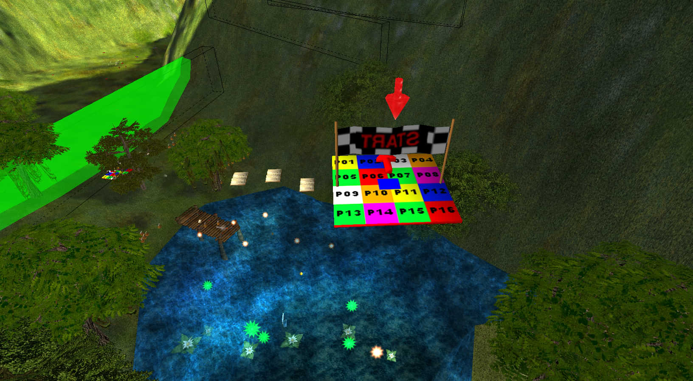
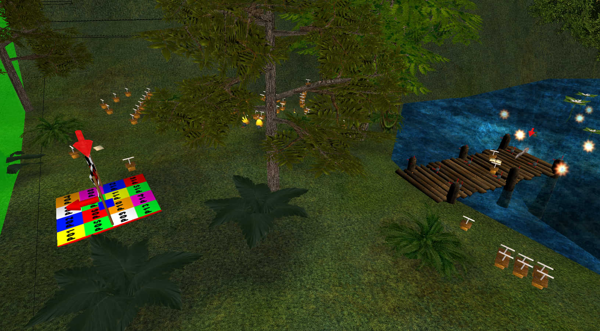
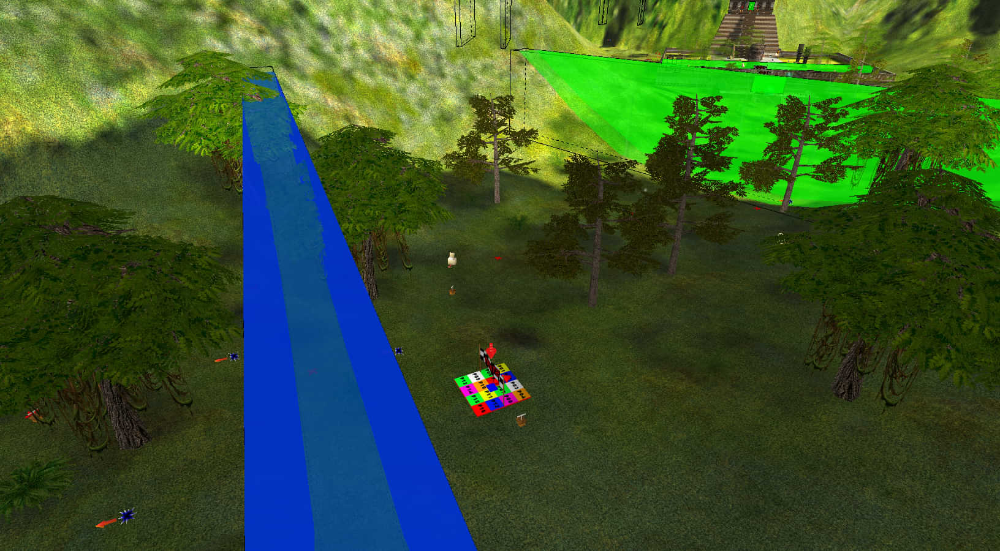
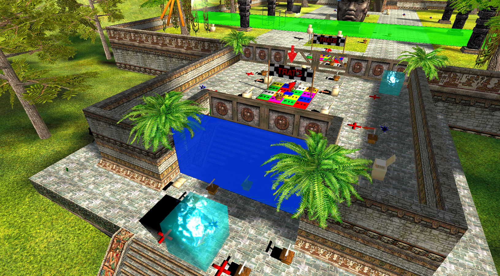
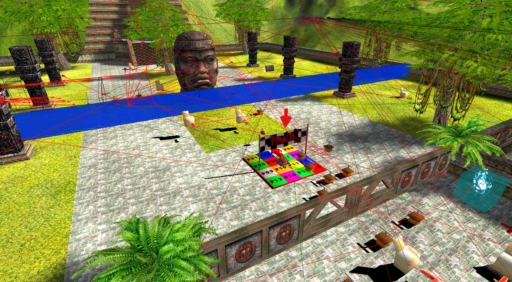
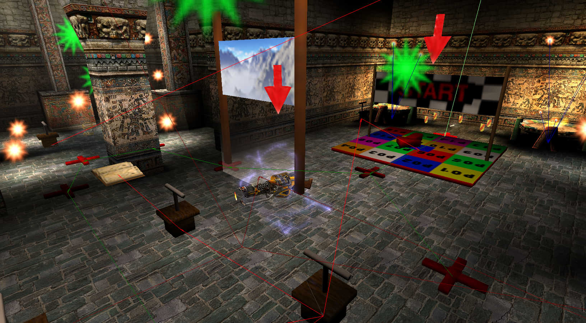
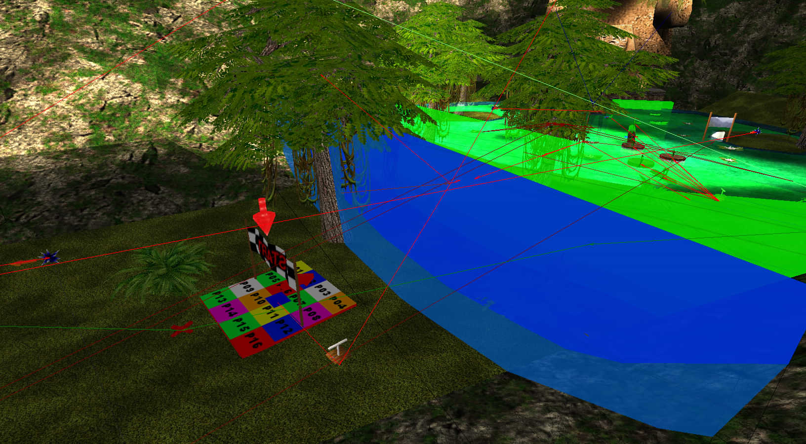
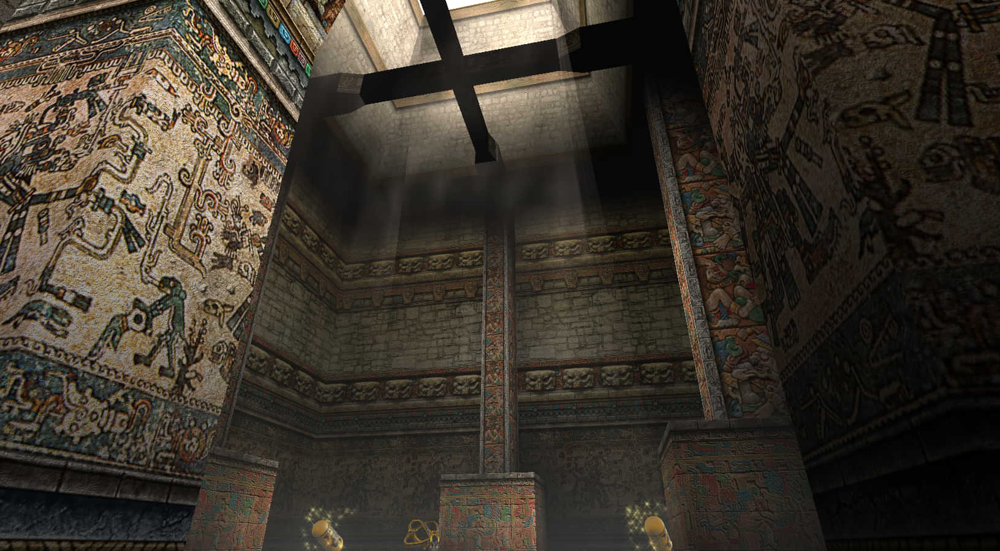
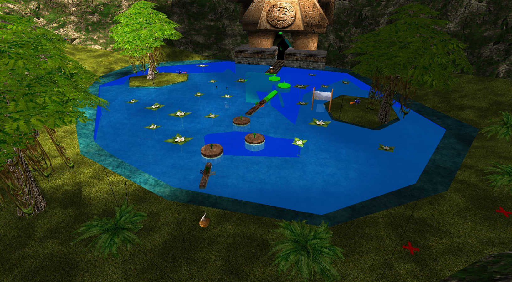

# Sierra de Chiapas

## Any% Tourist/Easy

## Any% Normal

## Any% Serious

## 100%

## Co-op
### Player markers
Here are the player markers and what you need to pick up or touch to activate them:

This is the spot where you can go out of bounds by either rocket jumping twice, or getting sniped while jumping straight up on someone's head

This spot is interesting: if you enter water from out of bounds, the TouchField will not trigger; it will trigger and spawn fish upon exiting rather than entering

### General notes
When you spawn in the air, you have movement control for a brief moment, meaning you can hold forward and get a significant push forward.
For full-game runs, 3 or 4 out of 6 players can take Serious Speed for the next level.
