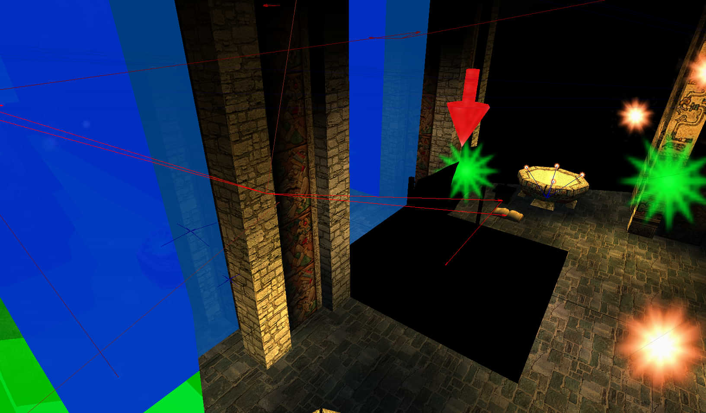
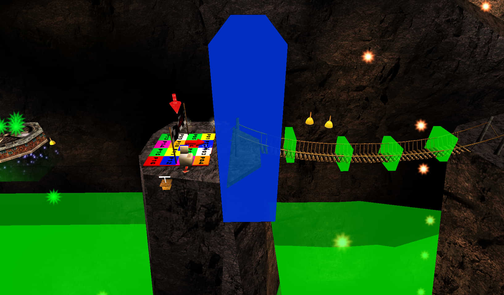
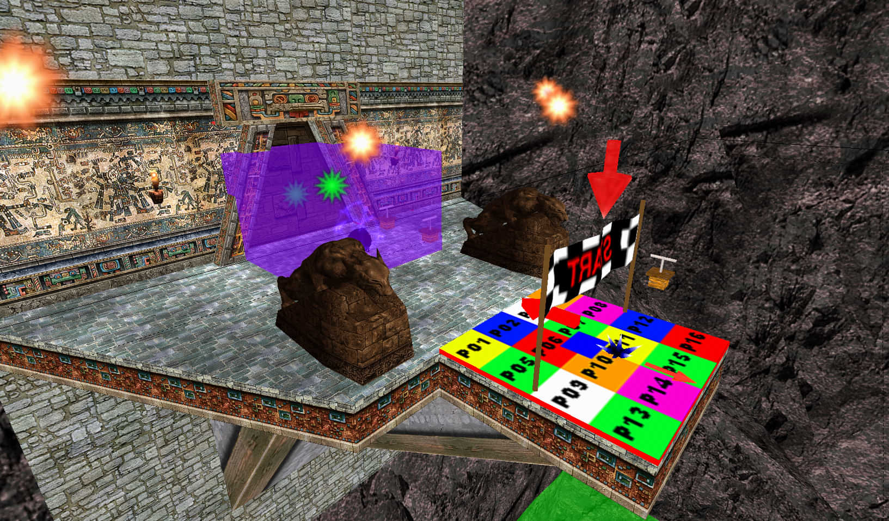
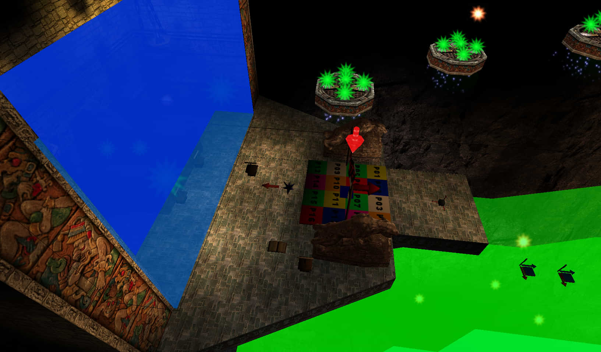
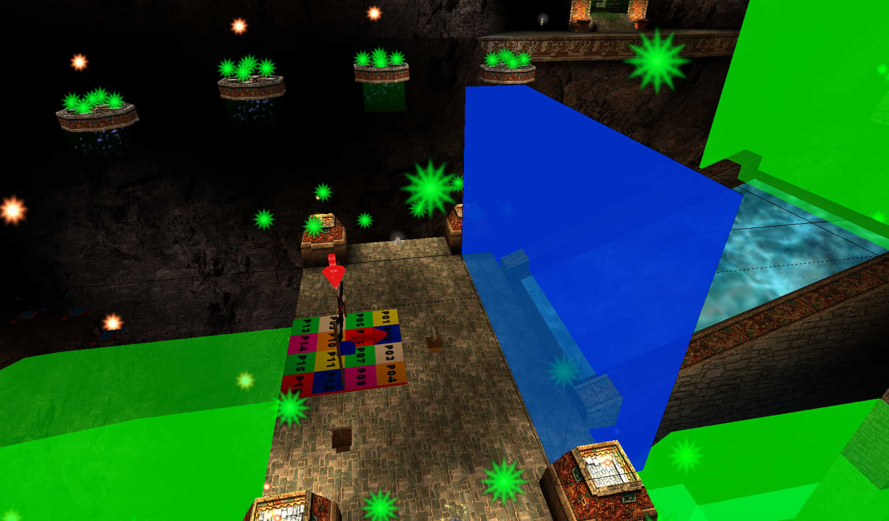
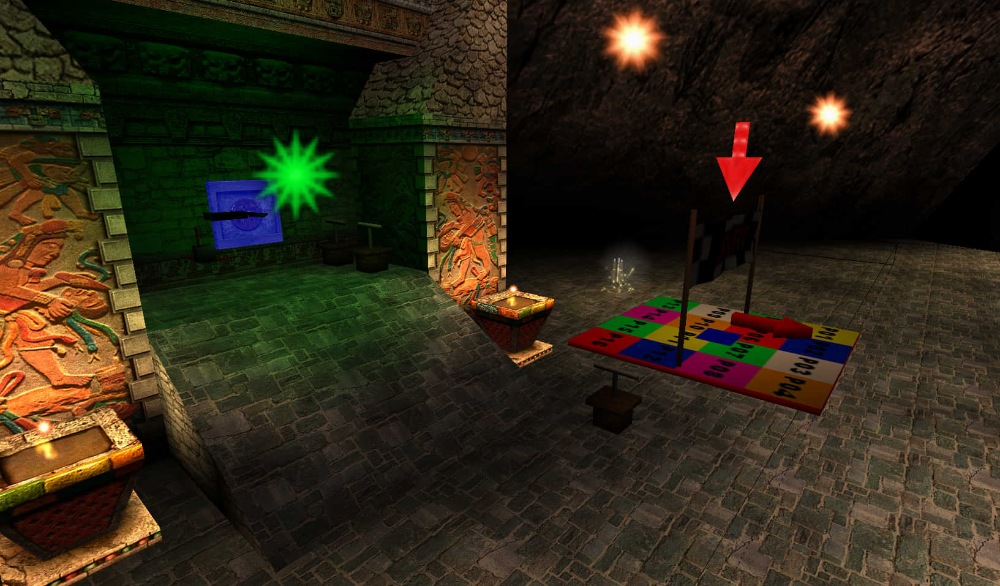
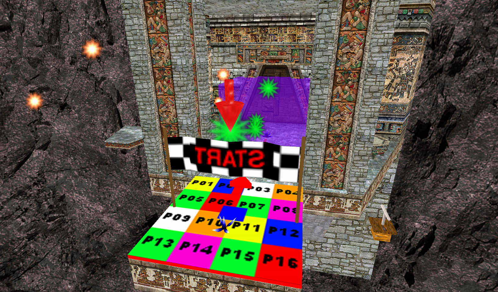
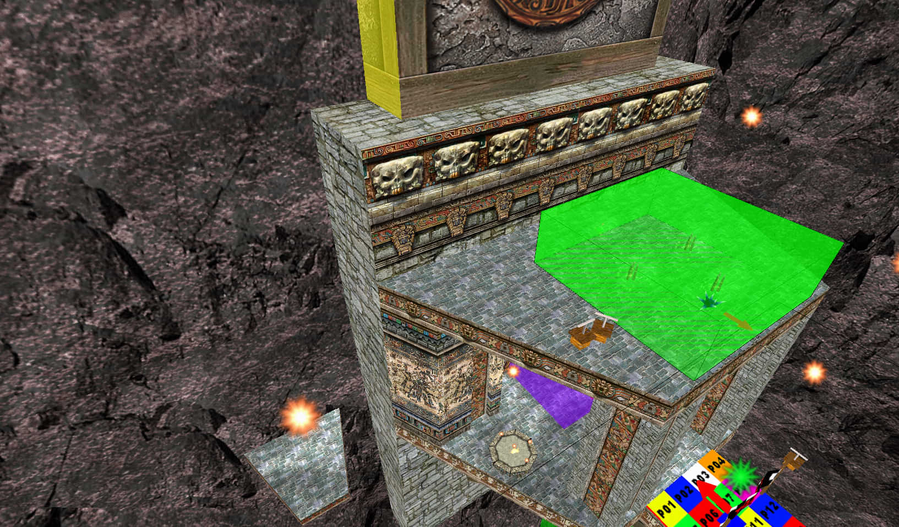
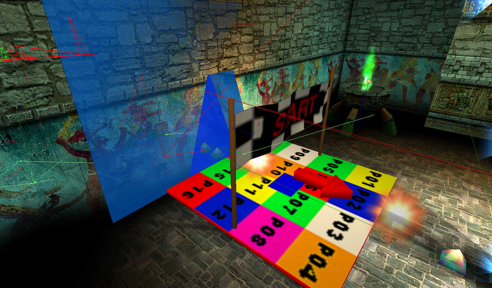

# Valley of the Jaguar

## Any% Tourist/Easy

## Any% Normal

## Any% Serious

## 100%

## Co-op
### Player markers
Here are the player markers and what you need to pick up or touch to activate them:

Spawn 4 is activated by the dool controller

Spawn 9 is activated by the door controller

This is the spot where you can go out of bounds by rubbing yourself against this surface (yellow) and jump-buffering repeatedly

This is the level end TouchField

### General notes
If carrying Serious Speed from the previous level, you can skip an entire cycle of the moving bounce pad by jumping perfectly, but this requires a lot of precision and possibly a boost from other players.
