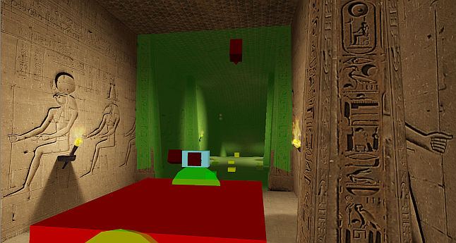
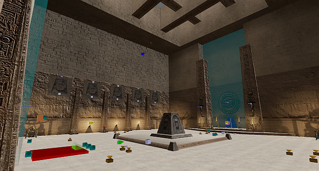

# Sand Canyon (Any%)

## Level End Trigger

Touch the following field located behind a door in the ending area.

## Route

Kill the two Gnaars to spawn a Kleer which is needed to jump over the gate at the end of the hallway. Be sure to kill the three Kamikazes behind the gate as soon as possible as doing so will spawn the Marsh Hoppers in the next room. When there, touch the [secret wall](../../100/02-sand-canyon/#indoor-area) to pick up the Tommygun which will help kill the Marsh Hoppers quicker.

A total of 18 Marsh Hoppers will spawn but killing 17 is enough to open up the door to the next area. From there it's a simple walk to the end of the level.

## IL

The IL strategy skips most of the level by performing a tree boost. Run to the hidden valley and jump onto the first tree to the right. Aim for the spot in the image (to be added), then walk backwards and buffer jump so you bump off the sloped terrain and fly all the way to the ending area. For the fastest time, avoid the teleport perimeter of the ending area as it puts you quite far away from the door.

