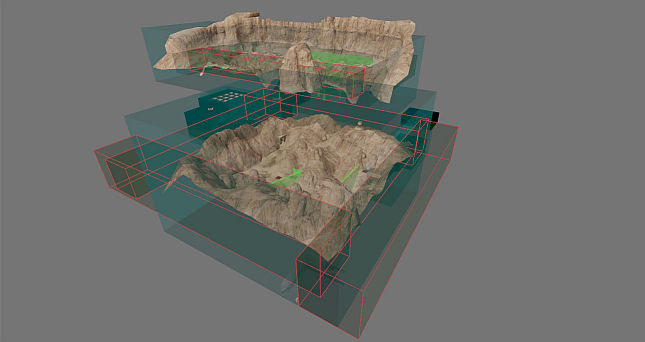

# Sand Canyon (Any%)

## Level End Trigger

Touch the following field located behind a door in the ending area.

## Route

## IL

The IL strategy skips most of the level by performing a tree boost. Run to the hidden valley and jump onto the first tree to the right. Aim for the spot in the image (to be added), then walk backwards and buffer jump so you bump off the sloped terrain and fly all the way to the ending area. For the fastest time, avoid the teleport perimeter of the ending area as it puts you quite far away from the door.

