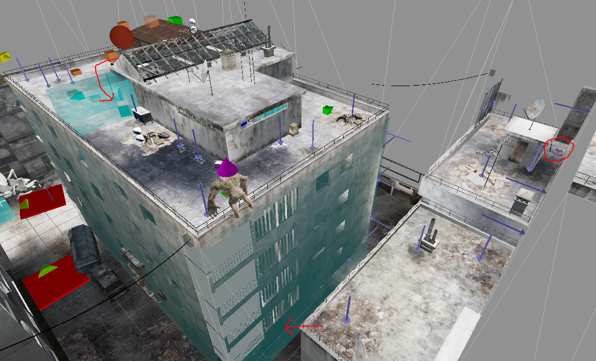
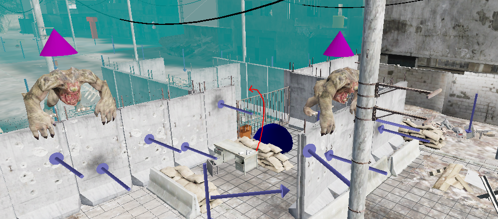
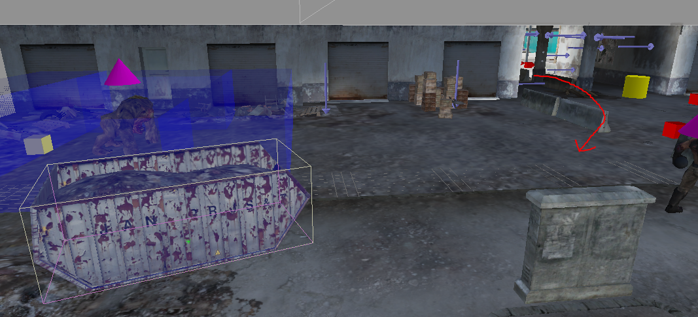

# Summer in Cairo

## Level End Trigger
This level ends upon hitting the following trigger in the entrance to the museum.

## Any%
#### Intro
Start off by running to the left and getting the secret sledgehammer. Then drop down one rooftop and *walk* off the edge. While in midair release sprint and so that you can switch to the sledgehammer.

The sledgehammer will be needed for skips later.

By dropping down one rooftop you will barely be able to survive walking off the edge, with about 15 health, while taking a shorter route. Jumping will kill you. You can also bump against the many small lips on the way down to cancel fall damage, but this takes longer.

There is no friction in midair, so you can safely release sprint without losing time. Doing so will allow you to switch weapons, which will finish by the time you hit the ground so that you can start sprinting again.

#### Streets
Follow the intended path down the streets a bit.

In the first alleyway you will come to a destructible wall that a gnar is knocking down. You can destroy this (and kill the gnar) with a single sledgehammer swing yourself to get through quicker. Make sure to pay attention to if your sledgehammer is raised or not, it can be worth waiting for it to raise in order to get the quicker attack animation.

On the next road normally you'd duck into another alley on the right. You can instead skip this section by jumping over the gate blocking you.

You can make the jump from either the desk or the sandbags, though note that the desk is destructible. If you miss the initial jump you can also try jump off of one of the gnars that will be blocking you.

#### Spaceship Skip
At the end of the next road you will come to the spaceship area. We will be skipping it entirely.

Normally, once you finish the area a gnar will knock down a breakable wall to let you exit. Like before, you can knock this down yourself with two sledgehammer swings, which skips the whole fight.

There is an additional skip you can do in this area too. Exactly 3.5s after you hit the starting trigger, you will be forced to look at the spaceship. Normally this forces your camera to slowly turn towards it. However, if you're already looking at that spot, it does nothing, and instantly gives back your camera control. If you time it right you can jump and turn to look at it just as it does this check, and then turn back before the jump lands, so that you don't waste any time not being able to sprint due to not looking the right direction.

#### The Boost
After the spaceship arena, follow the intended path for a bit until you pass under though the building. Turn left, kill the gnar that will block you, and walk up to the dumpster.

Perform a [physics boost](..\general-tricks#physics-boosts) off of this dumpter. To get the boost just line up in the right spot, shown below, then jump and hold forwards. You may want to switch to a pistol after killing the gnar so that you have a crosshair, but with practice you'll be able to do it without.

Note that the more FPS you have the better, so you should be looking straight down, the example is just looking higher for better reference.

Take the boost as far as possible, then follow the intended route for the rest of the level.

## Any% Coop
If a client triggers the spaceship cutscene, then nobody will have their view forced towards it, meaning there's no need to attempt the skip.

The wall you knock down in the spaceship arena takes two hits, so if two players get there at the same time they can do both hits at once. Note that this *does not* work if you have friendly fire on, one person will hit the other.

Outside of these two things, the level plays exactly like in singleplayer, just have everyone try follow the same route and whoever messes up least finishes the level.
