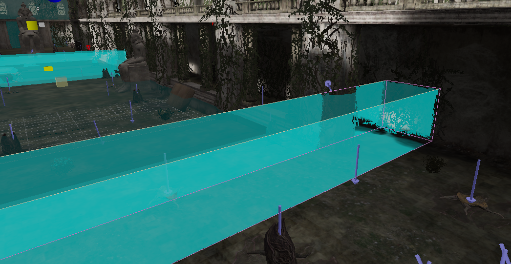
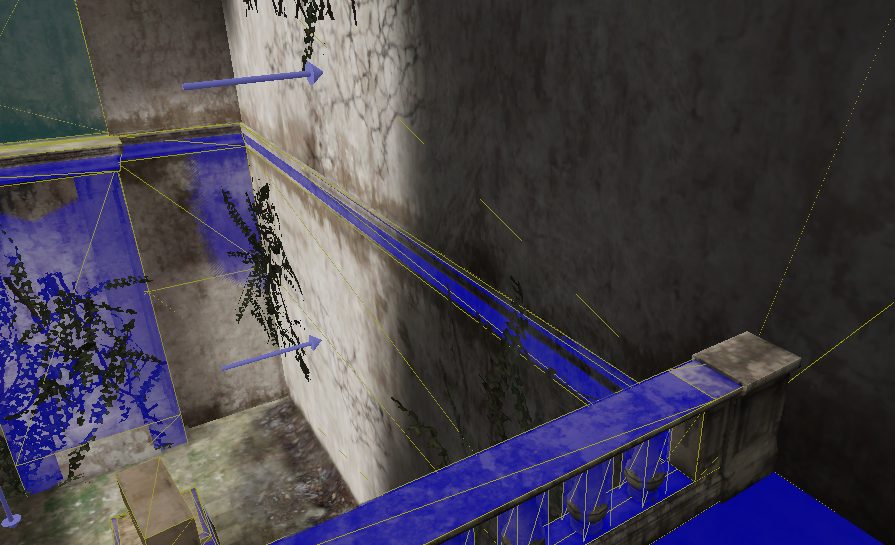
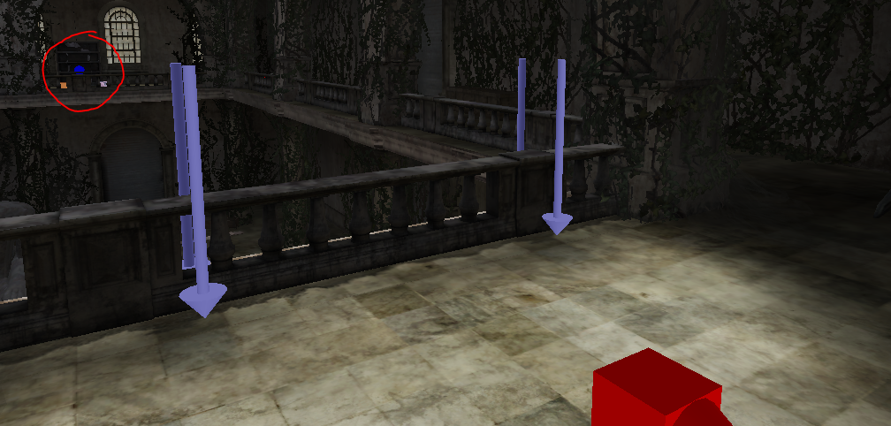
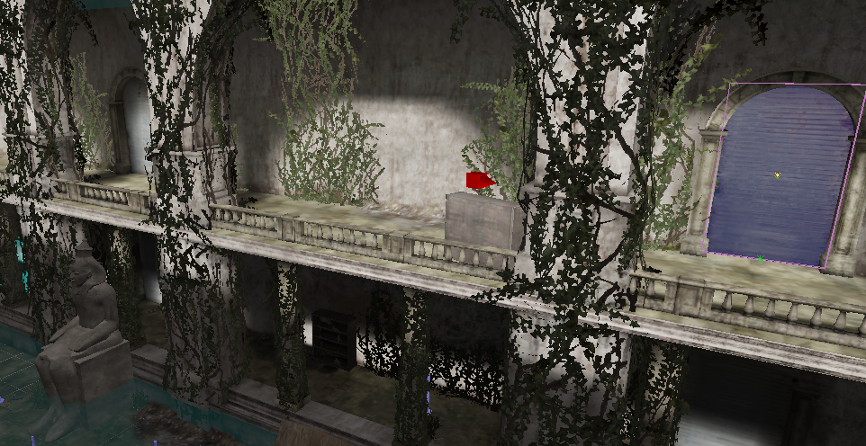

# Into the Spider's Nest

## Level End Trigger
This level ends upon hitting the following trigger behind the arachnid boss fight arena.

## Any%
#### The Darkness
The level with start with you in the darkness, without a flashlight. It will turn on in a few seconds, but waiting wastes time. You'll want to immediately turn right and climb up the staircase - while in the dark.

The "simple" way of doing this is just to learn the muscle memory to turn your camera just the right distance. There is a lot of annoying geometry you can get stuck on even if you just slightly over or undershoot, so there are a few other options you might want to consider.

Firstly, changing your colour settings, specifically gamma correction, can make it much easier to see in the dark. This however requires playing in fullscreen, and you will have to use the settings for the entire run, it is not worth it to switch settings just for this small segment.

Another option is to abuse muzzle flash. Whenever you shoot, it will very briefly light up the room, letting you get your bearings. This is especially effective when looking at the tile grid on the floor.

You can double check if you've made it up the stairs by looking for the health pack down the hallway. This doesn't come into view early enough to be useful to orient yourself however.

Whatever method you choose, make your way up the staircase and follow the intended route into the foyer.

#### Spider Cutscene Skip
Up in the foyer normally you'd have a small cutscene forcing your view into the middle of it, and, more significantly, slowing your movement speed. As the title might suggest, you can skip this. The cutscene start upon hitting the following trigger.

To skip the cutscene, you need to have something agro on you before hitting the trigger. Just shooting your pistol once is enough to do this. It's best to shoot in the middle of a jump, so that you don't lose time due to not sprinting.

#### Statue Climb
Next climb the statue on the right side of the room to get to the second floor. The climb works on both sides of the statue, with minor differences, but as the right side is closer, you should aim to learn the climb on it. High framerates make it extremely difficult/impossible, so it is very highly recommended to cap to 30fps.

Learning the climb really just requires practicing it. Jump onto the statue's lap from the walkway to the right, then walk as far up the arm as you can go before jumping on the shoulder. Once on the shoulder just holding forwards should get you to the very top, though you may occasionally want to jump to kill extra momentum.

#### Speedrun Secret
Once you've climbed up the statue you'll want to activate the speedrun secret. Yes, we'll be doing an intended skip. Unfortunately, you've just climbed up near where it ends, and will need to walk all around the level to properly trigger it. Doing the statue climb is still quicker however.

When you come to the end of the first balcony there's actually a small lip against the wall you can walk on to be able to follow this path.

Once you've entered the doorway in the image above, continue along to the following bookcase.

Destroy the bookcase. This will reveal a button, which you should then press. You can start swinging the sledgehammer significantly before you make it to bookcase, as long as you're next to it when the animation finishes.

Once you've pressed the button, return back to where you started. Technically you could take the same path back in reverse, but it is quicker to drop down and do the statue climb again. Once you've climbed up the statue turn right instead, heading through the following door which should now be open.

#### Boss Skip
The level normally ends with a boss fight. However, as the [Level End Trigger](#level-end-trigger) section might hint at, you do not need to kill it in order to finish the level.

Here's the entrance to the boss arena, the grey wall being an invisible wall. Notably, there's a small lip sticking out past it not far from the entrance.

This lip actually continues all the way over to the other side of the arena, meaning if you can get on it you can walk right over the boss and jump into the exit trigger.

To do the skip, climb onto the higher entrance wall in the picture above, then just jump onto the lip. Don't aim right at the lip, aim to it's right, so that the edge of your model barely lands on it. It's also a good idea to make a quicksave beforehand, if you fall into the arena you can't get out. Once your on the lip just make sure to hug the (invisible) wall until you get over to the other side, and jump into the ending trigger.

## Any% Coop
Just like the spaceship cutscene in [Summer in Cairo](../01-summer-in-cairo/#any-coop), if a client hits the spider cutscene trigger first then no one will actually be affected by it. The skip only requires that a single player has agro, no restrictions on client/host or the order they hit the trigger, so it may also be worth just dedicating someone to always shoot.

With multiple players, you can parallelize opening the speedrun secret. Two players can attempt to climb the statue at once, then the first to make it runs to the button, while all players others wait by the door.

Because you can't quicksave in coop, if all players fail the boss skip you will have to fight it. Use the [sledgehammer glitch](../general-tricks.md#sledgehammer-glitch) to quickly kill it. Note that, even with just one player in the fight, the boss will die too quickly for the player who pressed the button to make it back to help, even if they immediately turn around.
